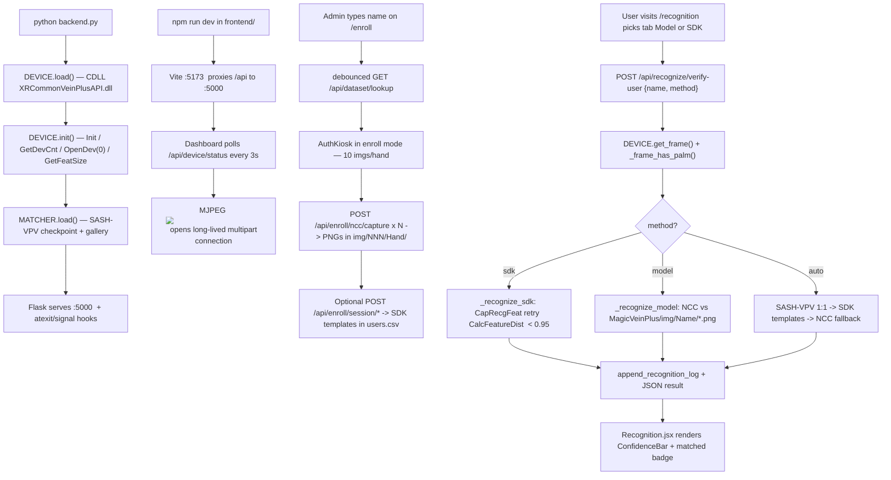

# Full Setup Prompt — Palm Vein Biometric System (XRTECH MagicVein Plus)

> **Use this document as a prompt** to recreate, extend, or hand off the full project to another developer or an AI coding agent. It describes every layer — hardware, backend, frontend, recognition pipeline, and data flow — in enough detail that the system can be reproduced end-to-end.

---

## 0. Project Goal & High-Level Brief

Build a full-stack **palm vein biometric authentication and recognition system** for Windows that uses the **XRTECH MagicVein Plus** USB near-infrared (NIR) palm vein scanner as its sole input device. The system must:

1. Talk to the scanner over USB via the vendor SDK (`XRCommonVeinPlusAPI.dll` v3.1.3, native C API, accessed from Python through `ctypes`).
2. Stream a **live MJPEG vein-mask preview** to a browser UI.
3. Allow an admin to **enroll** users by capturing multiple PNG vein-mask images per hand into a structured dataset folder, building a per-person reference library.
4. Provide a **multi-method recognition pipeline** (SDK feature matching + neural SASH-VPV embedder + image NCC fallback) for 1:1 identity verification.
5. Persist users, palm templates (base-64 SDK feature blobs), audit logs, and recognition events to CSV files.
6. Expose all functionality through a Flask **REST + MJPEG HTTP API** (port 5000), consumed by a React + Vite frontend (port 5173) via dev-time path proxying.
7. Cleanly release the USB device on shutdown so the libusb endpoint never gets stuck.

The XRTECH sensor itself is used **only for raw image acquisition** — frames go into the matching pipeline as PNGs / raw bytes; the SDK's built-in feature-match is one of three matching paths, not the only one.

---

## 1. Hardware Layer — The XRTECH MagicVein Plus

The sensor is a contactless 850 nm NIR palm-vein scanner. It enumerates as a USB device with **VID `0xA7A9`** and **PID `0x0620`**. On Windows it requires a **WinUSB** or **libusbK** driver bound via [Zadig](https://zadig.akeo.ie/) — the default Windows HID driver causes `PV_ERR_NO_DEVICE` (-2) or `PV_ERR_USB_PERMISION` (-41).

The vendor ships two binaries that the entire stack depends on:

- `XRCommonVeinPlusAPI.dll` — implements `XR_Vein_*` C functions (stdcall on Win64).
- `libusb-1.0.dll` — the USB transport layer used internally by the SDK; also enumerated directly by the backend for diagnostics.

Both DLLs must live in the same directory and that directory must be on the process `PATH` plus registered with `kernel32.SetDllDirectoryW(...)` before `ctypes.CDLL(...)` loads the API DLL.

Image specs the system relies on:

- **Image dimensions:** 480 × 640 px portrait, single-channel (grayscale), 1 byte per pixel → **307,200 bytes of valid pixel data per frame**.
- **Buffer the SDK requires:** 600 × 800 (= 480,000 bytes). Only the first 307,200 bytes contain the image; the rest is zero padding. Using 600 × 800 as the display geometry produces a tiled/garbled image — this was the single biggest empirical gotcha during integration.
- **Feature template:** 560 bytes (`XR_PALM_FEATURE_SIZE`); match threshold is **distance < 0.95** (`XR_VEIN_THRESH`).
- **Output kind:** the SDK returns a **binary vein mask** (pixel values in {0,1}); the backend rescales `1 → 255` before JPEG encode so it is actually visible.

---

## 2. Backend — How Live XRTECH Was Actually Wired Up

The entire backend lives in a single Python file, [`backend.py`](../backend.py), built on **Flask 2.3** with **Flask-CORS**, **Pillow**, and **NumPy**. There are two collaborating classes:

- `VeinDevice` (lines ~197–596) — a thin `ctypes` wrapper around the SDK DLL. It owns the SDK handle (`void*`), holds a `threading.Lock` around frame and feature calls, and is instantiated as a single global `DEVICE` for the process.
- `SashMatcher` (further down) — an optional neural embedder for recognition (see Section 4).

### 2.1 DLL bring-up sequence

On `__main__`, the backend prints a banner and then runs, in order:

1. `DEVICE.load()` — sets `PATH`, calls `SetDllDirectoryW(SDK_DIR)`, does `ctypes.CDLL(...XRCommonVeinPlusAPI.dll)`, then `_bind_signatures()` to set `argtypes`/`restype` for every used function. The **correct** bindings (empirically discovered after several wrong attempts) are documented in [`xrtech_device.py`](xrtech_device.py); the three critical ones are:
   - `XR_Vein_CapRecgFeat(ctx, feat*, len*, capTip*)` — **4 arguments**, not 3. Omitting `pCapTip` made it fail immediately.
   - `XR_Vein_CalcFeatureDist(f1, len1, f2, len2, &dist)` — both buffer lengths required.
   - `XR_Vein_CheckFeat(feat, len)` — **no** SDK handle in the first slot.
2. `DEVICE.init()` — runs `XR_Vein_Init(&ctx)` → `XR_Vein_GetDevCnt(ctx, &cnt)` → `XR_Vein_OpenDev(ctx, 0)` → `XR_Vein_GetFeatSize(ctx, &fs)`. It also calls `XR_Vein_GetSrcImgSize` for diagnostics, but the returned 600×800 is **ignored** (we hardcode 480×640).
3. `MATCHER.load()` — loads the SASH-VPV PyTorch checkpoint and rebuilds the per-person gallery from `Palm Vein SASH-VPV/Outputs/gallery_local.json` if available; failure is non-fatal.
4. Registers `atexit` and `signal` handlers (`SIGINT`, `SIGTERM`, `SIGBREAK`) that call `_graceful_shutdown()` → `DEVICE.deinit()` (`XR_Vein_CloseDev` + `XR_Vein_DeInit`). Skipping this leaves the USB endpoint stuck and you have to physically unplug the scanner.
5. `app.run(host="0.0.0.0", port=5000, threaded=True)`.

### 2.2 The frame loop (live MJPEG)

`GET /api/stream` returns `multipart/x-mixed-replace; boundary=frame`. The Flask generator runs an unbounded loop that:

1. Allocates a 600×800 `c_ubyte` buffer, calls `XR_Vein_GetStdVeinImage(ctx, buf, &got)`.
2. Slices `buf[:307200]` (= valid 480×640 portion).
3. Passes it to `_encode_frame_jpeg(raw, 480, 640, 1)`, which builds a Pillow `Image.frombytes("L", ...)`, scales the binary mask to 0/255, dilates with a 3-px max-filter so 1-px-wide vein outlines are visible, and encodes JPEG quality 90.
4. Emits a properly-formed multipart MJPEG part and sleeps ~20 ms (≈50 fps cap, in practice 25–30 fps).
5. On 100 consecutive errors the loop exits gracefully.

A single-shot `GET /api/frame` follows the same encode path. A `GET /api/device/raw` route is available for clients that want the unencoded mask bytes.

### 2.3 USB diagnostics

`_enumerate_usb()` loads `libusb-1.0.dll` directly through ctypes and walks `libusb_get_device_list` to return every connected device descriptor (`vid`, `pid`, `class`). It is exposed at `GET /api/device/usb` and embedded in the `/api/device/init` response so the UI can show "is the scanner visible to libusb at all?".

### 2.4 REST surface (all routes in `backend.py`)

| Group | Routes | Purpose |
|-------|--------|---------|
| Device lifecycle | `POST /api/device/load`, `POST /api/device/init`, `POST /api/device/deinit`, `POST /api/device/reconnect`, `GET /api/device/status`, `GET /api/device/usb`, `GET /api/device/stream-status` | Connect, disconnect, reconnect, diagnose |
| Streaming & capture | `GET /api/stream`, `GET /api/frame`, `GET /api/device/raw`, `POST /api/capture` | MJPEG, single JPEG, raw bytes, save-to-disk + extract feature |
| Hardware | `POST /api/device/rgb/set\|preset`, `GET /api/device/rgb/status`, `POST /api/device/volume/set`, `GET /api/device/volume/status`, `POST /api/feature/check` | LED, speaker, feature validation |
| Auth (password + biometric) | `POST /api/register`, `POST /api/login`, `GET /api/users`, `GET /api/logs` | User store + audit |
| Enrollment | `POST /api/enroll/session/start\|capture\|finish\|cancel`, `GET /api/enroll/session/status`, `POST /api/enroll/start\|finish`, `GET /api/enroll/status`, `POST /api/enroll/ncc/capture`, `GET /api/enroll/ncc/status` | SDK-driven 10-sample-per-hand enrollment + per-person reference-image capture |
| Identities | `GET /api/identities`, `DELETE /api/identities/<id>`, `GET /api/dataset/lookup` | Enumerate users and dataset persons |
| Recognition | `POST /api/recognize/verify-user`, `GET /api/recognize/sdk-status`, `GET /api/recognize/gallery/status`, `POST /api/recognize/gallery/rebuild`, `GET /api/recognition/logs` | Cascade 1:1 verification + SASH gallery management |

### 2.5 Data persistence

Everything is **file-based** — no SQL server is required:

- `users.csv` — `id, name, username, password_hash (SHA-256), role, features_b64 (pipe-separated base64 SDK templates), created_at`.
- `auth_logs.csv` — login audit (`Palm Vein` vs `Password`, confidence, IP).
- `recognition_logs.csv` — every `/api/recognize/verify-user` call (`userName, method, matched, confidence`).
- `folder_mapping.csv` — `Folder ID → Person Name` map for the dataset.
- `img/<NNN>/{Left,Right}/*.png` — primary NUTECH-PVD dataset (the "gallery" for SASH-VPV; folder IDs `001`–`122`).
- `MagicVeinPlus/img/<Person Name>/ref_<timestamp>.png` — per-person reference images captured live for the NCC fallback.
- `MagicVeinPlus/img/<timestamp>_<label>.png` — ad-hoc captures from `POST /api/capture`.
- `Palm Vein SASH-VPV/Outputs/` — `sash_vpv_embedder_best.pt` (PyTorch checkpoint), `gallery_local.json` (512-d per-person embeddings), `matching_calibration.json` (threshold ≈ 0.1149).

---

## 3. Frontend — React + Vite Dashboard

The UI is a single-page **React 18 + Vite** app under [`frontend/`](../frontend), bootstrapped with `react-router-dom`, a tiny **Zustand** store (`useAppStore`), and a `useWebSocket` hook that keeps an optional connection to the legacy Node bridge on port 3000. The whole frontend is talking to the Python backend on port 5000 through Vite's dev proxy ([`vite.config.js`](../frontend/vite.config.js)) — every scanner-related path (`/api/stream`, `/api/frame`, `/api/capture`, `/api/recognize/*`, `/api/device/*`, `/api/enroll/*`, `/api/login`, `/api/register`, `/api/users`, `/api/logs`, `/api/identities`, `/api/dataset`, `/api/recognition/logs`) is rewritten to `http://localhost:5000`; only `/ws` and the catch-all `/api` go to the Node bridge on `:3000`.

### 3.1 Public pages (no auth required)

| Route | Component | Purpose |
|-------|-----------|---------|
| `/` | `Landing.jsx` | Marketing landing — hero, features highlight, CTAs |
| `/login` | `Login.jsx` | Username + password login (`POST /api/login`); on success stores user in Zustand and navigates to `/dashboard` |
| `/register` | `Register.jsx` | New user signup (`POST /api/register`) — only writes username/password row; palm enrollment happens later |
| `/kiosk` | `AuthKiosk.jsx` | Standalone biometric kiosk — full-screen MJPEG preview with animated scan corners, capture button, "XR LIVE" badge; supports an "enroll mode" passed via `location.state` that collects 10 images per hand |
| `/features`, `/how-it-works`, `/contact` | `Features.jsx`, `HowItWorks.jsx`, `Contact.jsx` | Static marketing content |

### 3.2 Protected pages (admin / user)

All wrapped in `<ProtectedRoute>`, which gates access on the Zustand `user` slot.

| Route | Component | Purpose & key UI |
|-------|-----------|------------------|
| `/dashboard` | `Dashboard.jsx` | Polls `/api/device/status` and `/api/device/stream-status` every 3 s, shows StatCards (image size, feature size, connected identities, dataset count) plus a live MJPEG `` and a **Reconnect** button that calls `POST /api/device/reconnect` and remounts the `` with a new `streamKey` so a fresh MJPEG connection opens |
| `/preview` | `LivePreview.jsx` | Pure full-frame MJPEG viewer with frame-rate badge |
| `/enroll` | `Enrollment.jsx` | Admin-only typed name field, debounced 400 ms lookup against `/api/dataset/lookup` that returns existing folder info or a suggested new ID, then opens `AuthKiosk` in **enroll mode** to capture 10 PNGs per hand into `img/<NNN>/Left` and `img/<NNN>/Right` |
| `/recognition` | `Recognition.jsx` | Two tabs: **Model Recognition** (image-NCC + experimental SASH info) and **SDK Recognition** (XR feature-template match). Each tab polls `/api/device/status` + `/api/device/stream-status`, shows the live stream, the per-tab reference count, the user's name, a "Verify Identity" button that calls `POST /api/recognize/verify-user` with `{name, method}`, and renders the JSON result as a `ConfidenceBar` plus matched/no-match badge and elapsed-ms chip |
| `/identities` | `Identities.jsx` | Lists all enrolled users (`GET /api/identities`) — toggle between live-user store and dataset-only persons, search box, delete button (`DELETE /api/identities/:id`) |
| `/device` | `DeviceControl.jsx` | LED preset palette (Off/Red/Green/Blue/Cyan/Magenta/Yellow/White → `POST /api/device/rgb/preset`) plus a volume slider (`POST /api/device/volume/set`), each reflecting current state pulled from `/api/device/status` |
| `/log` | `RecognitionLog.jsx` | Table of `recognition_logs.csv` rows (`GET /api/recognition/logs`) — filterable by user/method/result, with timestamp and confidence column |
| `/settings` | `Settings.jsx` | Profile + theme prefs (UI-only; no backend persistence) |

### 3.3 Reusable components

- `NavBar` — top-level navigation, hidden on public routes via the `PUBLIC_PATHS` set in `App.jsx`.
- `BackButton`, `ProtectedRoute` — routing helpers.
- `DeviceStatusBadge` — pill that shows `connected / driver_ok / streaming` derived from polling.
- `VeinCanvas` — wraps the MJPEG `` with scan-line animation overlay used in `AuthKiosk`.
- `LedRingVisualizer`, `RgbPicker`, `PalmdistGauge` — purely visual widgets for the `/device` page.

### 3.4 State, polling, and the "stream key" trick

Every page that depends on device liveness polls `/api/device/status` and `/api/device/stream-status` on a 1.5 – 3 s interval and writes the result into local component state (Dashboard also pushes into Zustand). The MJPEG `` is always given `src={`/api/stream?t=${streamKey}`}`; setting `streamKey = Date.now()` after a reconnect forces the browser to drop the old connection and reopen — without this the stale connection can keep delivering the last-buffered frame and look frozen.

### 3.5 Dev startup

```bash
# Terminal 1 — backend (must come first; opens USB device)
python backend.py        # http://localhost:5000

# Terminal 2 — frontend
cd frontend
npm install
npm run dev              # http://localhost:5173
```

---

## 4. Recognition Feature — Detailed Paragraph

The recognition page (`/recognition` → `Recognition.jsx`) is a deliberate **cascade of three matchers**, all served by the same endpoint `POST /api/recognize/verify-user` with body `{name, method}` (`method` ∈ `"auto" | "model" | "sdk"`). The cascade exists because no single matcher works in every scenario the project supports, so the backend chooses the right one based on what data has been enrolled for that person. **In every path, the very first step is `DEVICE.get_frame()` followed by a palm-presence heuristic** (`_frame_has_palm` rejects frames where less than 0.3 % of the 480×640 mask is non-zero) so we never run recognition on an empty/black frame. If `method == "sdk"` and the user has stored 560-byte feature templates in `users.csv` (`features_b64` column, pipe-separated base64), `_recognize_sdk` calls `XR_Vein_CapRecgFeat` with up to 20 retries (50 ms between attempts) until the SDK accumulates enough vein information to return a probe template, then iterates every stored template through `XR_Vein_CalcFeatureDist(probe, len, stored, len, &dist)` and takes the minimum distance; a match is `dist < 0.95` (vendor threshold from `xr_ret.h`) and confidence is mapped linearly as `(1 - dist/0.95) * 100`. If `method == "model"`, the system runs `_recognize_model` which performs **normalized cross-correlation (NCC)** between the live raw vein-mask frame and up to 20 randomly-sampled PNGs from the user's reference folder under `MagicVeinPlus/img/<Name>/` — both images are histogram-equalized and resized to 120×160 first; the top 3 NCC scores are averaged, a match is `top3_avg ≥ 0.38`, and confidence is rescaled into a 0–100 range; an optional SASH-VPV cosine similarity is computed and returned as `experimental_neural` info but **does not affect the decision**. The default `method == "auto"` runs in a smarter cascade: it tries the **SASH-VPV neural embedder first** (1:1 verification against only this user's `<folder_id>_Left` and `<folder_id>_Right` gallery vectors — never 1:N across all 244 entries, because the calibrated threshold is low enough that 1:N would hallucinate matches almost every time), then falls through to the **XR SDK feature match** if SASH didn't apply, and finally falls back to the **image NCC** path if no SDK templates exist. Every recognition call writes a row to `recognition_logs.csv` via `append_recognition_log(name, method_label, matched, confidence)` and the response always carries `{success, matched, name, confidence, best_similarity, images_compared, method, time_ms}` so the UI can render a uniform result card regardless of which matcher actually fired. The Recognition page also has a small **"Capture Reference"** workflow (`POST /api/enroll/ncc/capture`) that snaps the current live frame, saves it as `ref_<timestamp>.png` under `MagicVeinPlus/img/<Name>/`, and increments the displayed reference-image count — this is how the per-user NCC gallery gets populated without leaving the page.

---

## 5. How XRTECH Is Actually Used — Raw Image Capture + Folder Save

It is important to be precise about what the sensor's job is in this project: **the XRTECH scanner is used primarily as a raw image acquisition device that produces 480×640 binary vein-mask frames; the project's recognition decision then runs on those frames (or on derived feature templates) using its own pipeline**. Concretely:

1. Every call to the SDK frame API `XR_Vein_GetStdVeinImage(ctx, buf, &len)` allocates a 600×800 byte buffer, fills only the first 307,200 bytes with the vein mask, and the backend slices that down to the valid 480×640 region. That sliced byte buffer **is** the canonical "raw frame" passed everywhere else in the system.
2. For the **MJPEG live preview** (`/api/stream`) and **single-frame** (`/api/frame`) endpoints, the raw bytes are run through `_encode_frame_jpeg(raw, 480, 640, 1)` — Pillow loads them as mode `"L"`, scales `1 → 255` (with a 3-px max-filter dilation for visibility) and encodes JPEG quality 90. **No vein-feature extraction is done on the streaming path.**
3. For **ad-hoc captures** (`POST /api/capture`), the same encode runs, but the JPEG is also re-loaded with Pillow and saved as a **lossless PNG** to `MagicVeinPlus/img/<timestamp>_<safe_label>.png` (helper `_save_capture_image`). The endpoint additionally attempts feature extraction via `DEVICE.capture_feature()` (`XR_Vein_CapRecgFeat` retry loop) and returns `feature_b64` if it succeeded — but the saved file is the PNG, not the feature.
4. For **enrollment**, two complementary flows exist:
   - **SDK enrollment session** (`/api/enroll/session/*`) — calls `XR_Vein_StartEnrollPalm`, then repeatedly captures features with `capture_feature()`, validates each with `XR_Vein_CheckFeat`, and on `finish_enroll` writes the merged 560-byte template plus per-sample templates into the user's `features_b64` column in `users.csv`. **No image is saved in this path.**
   - **NCC reference-image enrollment** (`POST /api/enroll/ncc/capture` and the Enrollment page's 10-images-per-hand flow) — grabs the live raw frame, checks `_frame_has_palm`, encodes JPEG, re-decodes with Pillow, and saves as `ref_<timestamp>.png` (NCC path) or `<Folder>/Left|Right/<NN>.png` (dataset path) under `MagicVeinPlus/img/<Name>/` and `img/<NNN>/<Hand>/`. **This is the path that turns the XRTECH sensor into a dataset acquisition device.**
5. The dataset folder layout the system enforces is:

   ```
   img/
   ├── 001/
   │   ├── Left/    01.png 02.png … 10.png
   │   └── Right/   01.png 02.png … 10.png
   ├── 002/
   │   ...
   └── folder_mapping.csv     (Folder ID, Person Name)

   MagicVeinPlus/img/
   ├── <Person Name>/
   │   ├── ref_20260619_143012_001234.png
   │   └── ...
   └── 20260619_143012_scan.png        # ad-hoc captures
   ```
6. Recognition then consumes those PNGs (NCC matcher → re-loads the per-user reference folder; SASH-VPV → reads `img/<NNN>/{Left,Right}/*.png` to build/rebuild `gallery_local.json` of 512-d embeddings) and/or the SDK feature templates in `users.csv`. So the XRTECH device's responsibility is **(a)** stream a vein-mask preview, **(b)** produce a raw byte frame on demand that the backend immediately converts to PNG and stores in the appropriate folder, and **(c)** when the SDK matching path is being used, emit a 560-byte feature template via `CapRecgFeat`. Everything else — the cascade decision, the NCC math, the neural embedding, the per-user gallery — runs in the project's own Python code, not the SDK.

---

## 6. End-to-End Workflow (Bring-up → Verify a User)



---

## 7. File-by-File Reference (the parts that matter)

```
Version_1/
├── backend.py                              # Flask + VeinDevice + SashMatcher; the whole backend
├── requirements.txt                        # flask, flask-cors, pillow, numpy (torch/opencv optional)
├── users.csv, auth_logs.csv,
│   recognition_logs.csv, folder_mapping.csv
├── img/<NNN>/{Left,Right}/*.png            # Primary dataset (NUTECH-PVD)
├── MagicVeinPlus/img/                      # Live captures + per-user NCC refs
├── Palm Vein SASH-VPV/Outputs/             # PyTorch checkpoint + gallery_local.json
├── XRCommonVeinPlus/.../win_x64/           # SDK DLLs (must be present at runtime)
├── C++/sdk/.../xr_vein_api.h, xr_ret.h     # SDK headers (reference)
├── C++/sdk/.../Sample/ApiSample.cpp        # Vendor enrollment/recognition sample
└── frontend/
    ├── vite.config.js                      # Path proxy table -> :5000 + :3000
    ├── package.json                        # react 18, react-router-dom, zustand, recharts, vite
    └── src/
        ├── App.jsx                         # Router + PUBLIC_PATHS gating
        ├── main.jsx
        ├── store/useAppStore.js            # Zustand: user, connected, palmDist, ...
        ├── hooks/useWebSocket.js           # Connects to Node bridge :3000/ws
        ├── components/                     # NavBar, ProtectedRoute, VeinCanvas, ...
        └── pages/                          # Landing, Login, Register, AuthKiosk, Dashboard,
                                            # LivePreview, Enrollment, Recognition,
                                            # Identities, DeviceControl, RecognitionLog, Settings
```

The `XRTECH_Portable_Kit/` folder next to this prompt contains a self-contained subset you can drop into any other project: `xrtech_device.py` (ctypes wrapper), `sensor_service.py` (optional Flask sensor microservice), `example_main.py` (smoke test), `requirements.txt`, `README.md`, the full setup guide `XRTECH_SETUP.md`, and the `sdk/` folder with both DLLs and the C headers.

---

## 8. Reproducing the System From This Prompt

A developer (or coding agent) handed this document should be able to recreate the project by:

1. **Hardware:** plug in the XRTECH scanner, run Zadig, bind WinUSB to VID `A7A9` / PID `0620`. Copy `XRCommonVeinPlusAPI.dll` + `libusb-1.0.dll` into `XRCommonVeinPlus/XRCommonVeinPlus_V3.1.3_t113s/Library file/win_x64/`.
2. **Backend:** create `backend.py` with the structure described in Section 2 — `VeinDevice` class wrapping the SDK with the corrected `ctypes` signatures, a `SashMatcher` if neural matching is desired, and Flask routes mirroring Section 2.4. Persist users, logs, and the dataset to CSV/PNG exactly as in Section 2.5.
3. **Frontend:** `npm create vite@latest -- --template react`, add `react-router-dom`, `zustand`, `recharts`, configure `vite.config.js` with the proxy map from Section 3, then build the 12 pages listed in Section 3.2 talking to the backend over `/api/*` and rendering the MJPEG stream with ``.
4. **Recognition:** implement the three-matcher cascade described in Section 4 behind a single `POST /api/recognize/verify-user` endpoint and surface it through the two-tab `Recognition.jsx` page.
5. **Image storage:** wire `POST /api/capture` and `POST /api/enroll/ncc/capture` to convert the raw 480×640 vein-mask bytes to PNG via Pillow and save under `MagicVeinPlus/img/` and `img/<NNN>/{Left,Right}/` as in Section 5.
6. **Shutdown safety:** register `atexit` + `signal` handlers that call `DEVICE.deinit()` so the USB endpoint always releases.

Every magic number that matters (480×640, 600×800 buffer, 307,200 valid bytes, 560-byte feature, 0.95 SDK threshold, 0.38 NCC threshold, 0.1149 SASH threshold, 20 retries × 50 ms for `CapRecgFeat`, 0.3 % palm-presence threshold) is documented above so the rebuild matches the original behavior bit-for-bit.

---

*This prompt corresponds to the project at `c:\Users\huzai\Downloads\Palm Vein Final\Version_1\` and the portable kit at `XRTECH_Portable_Kit/`. SDK reference: XRCommonVeinPlus V3.1.3 for XRTECH MagicVein Plus (VID `0xA7A9`, PID `0x0620`).*
