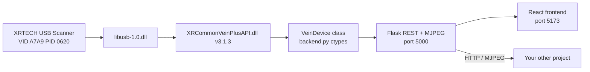
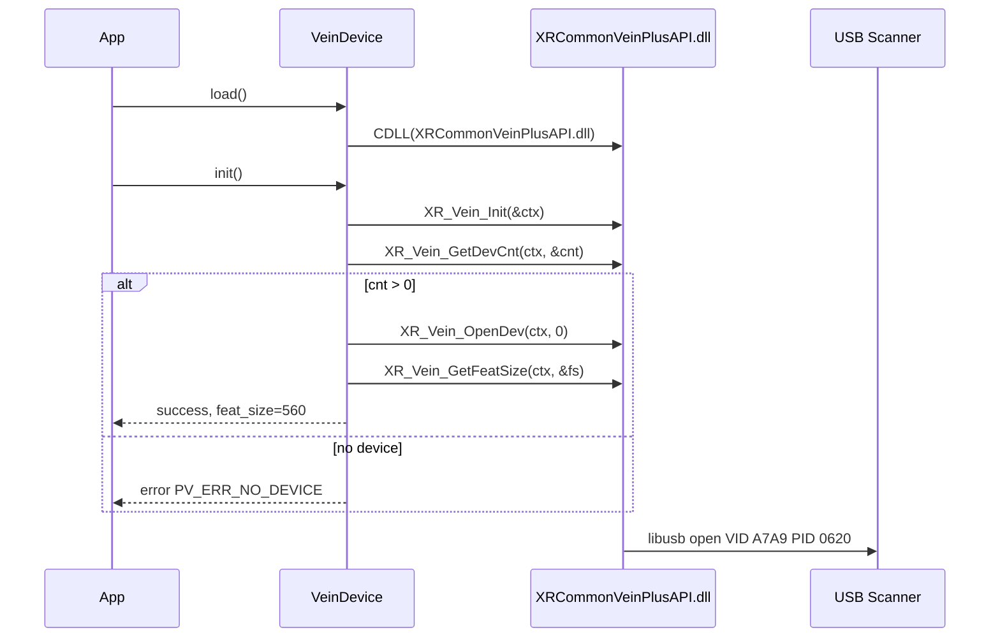
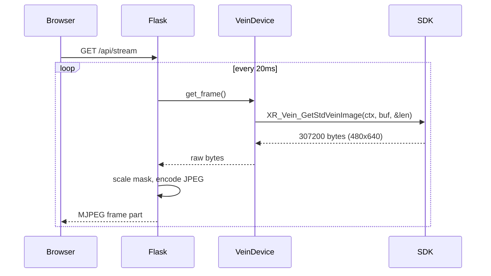
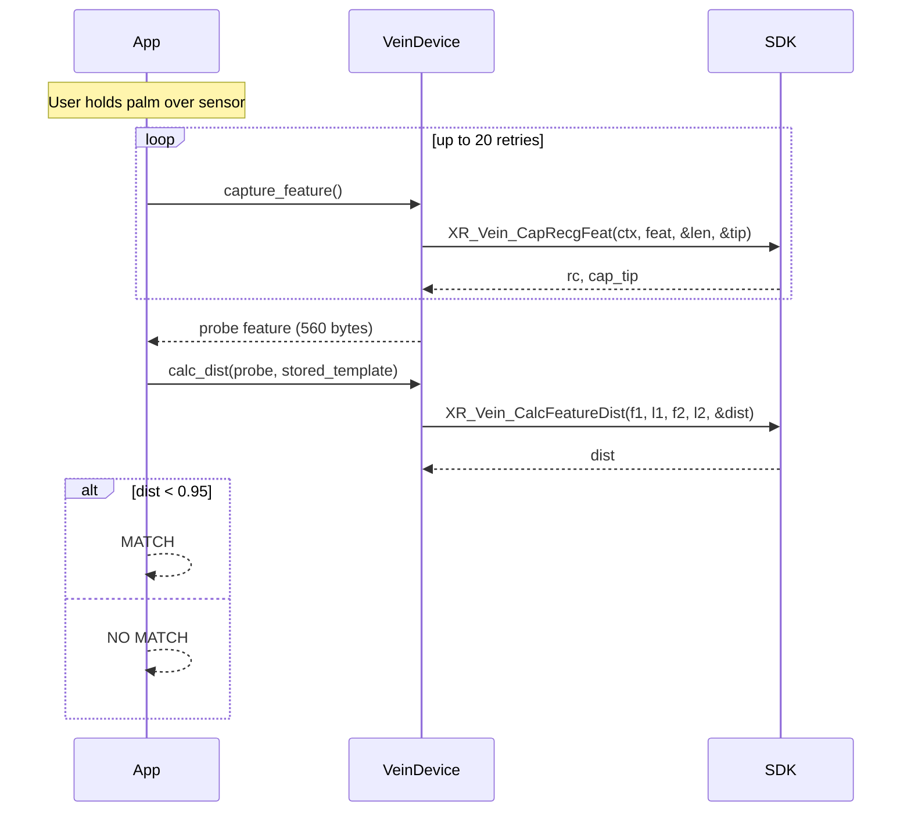
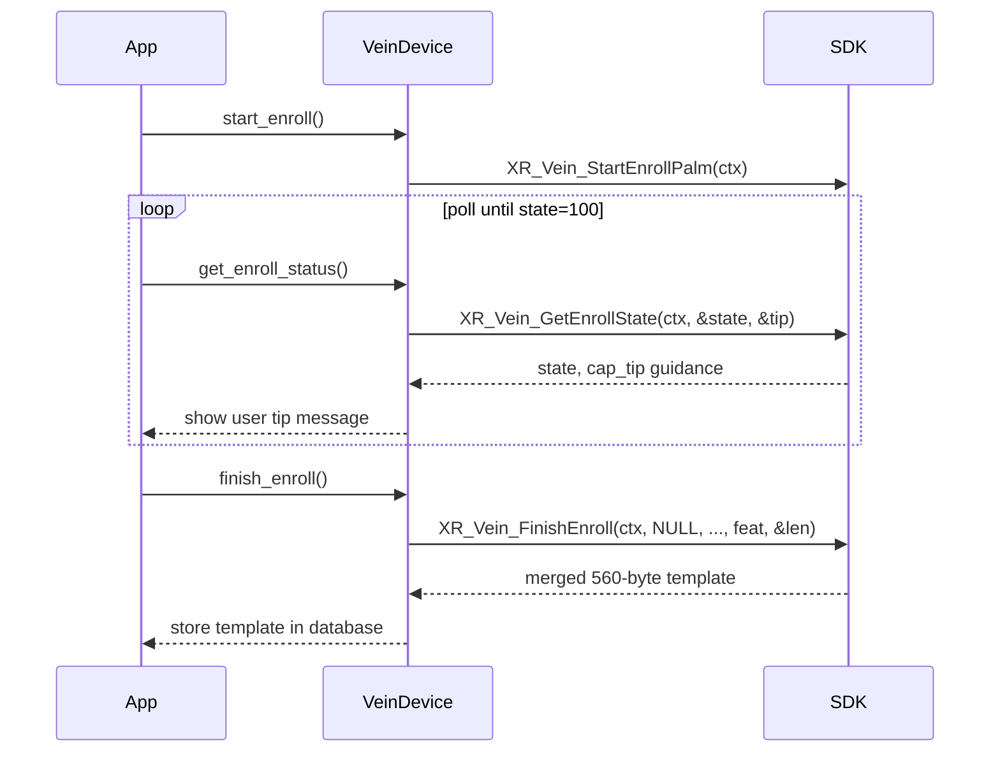

# XRTECH MagicVein Plus — Complete Setup & Integration Guide

This document is the authoritative reference for connecting, configuring, and integrating the **XRTECH MagicVein Plus** USB palm vein scanner. It consolidates everything needed to use the sensor in this project **or any other project** — via direct Python ctypes (embedded) or HTTP client (remote service).

**SDK version:** XRCommonVeinPlus **V3.1.3** (`XRCommonVeinPlus_V3.1.3_t113s`)

---

## Table of Contents

1. [Hardware Overview](#1-hardware-overview)
2. [Prerequisites and Driver Setup (Windows)](#2-prerequisites-and-driver-setup-windows)
3. [SDK Package Layout](#3-sdk-package-layout)
4. [How This Project Uses the Sensor](#4-how-this-project-uses-the-sensor)
5. [SDK API Reference](#5-sdk-api-reference)
6. [Critical Implementation Details (Gotchas)](#6-critical-implementation-details-gotchas)
7. [Approach A — Standalone Python Module (Direct ctypes)](#7-approach-a--standalone-python-module-direct-ctypes)
8. [Approach B — HTTP Client (Run Backend as a Service)](#8-approach-b--http-client-run-backend-as-a-service)
9. [This Project's File Structure (XRTECH-Relevant)](#9-this-projects-file-structure-xrtech-relevant)
10. [End-to-End Flows](#10-end-to-end-flows)
11. [Linking the Live Sensor to Your Other Project](#11-linking-the-live-sensor-to-your-other-project)
12. [Troubleshooting](#12-troubleshooting)

---

## 1. Hardware Overview

| Property | Value |
|----------|-------|
| **Device name** | XRTECH MagicVein Plus |
| **Connection** | USB only (not serial, not WiFi for this model) |
| **USB Vendor ID (VID)** | `0xA7A9` |
| **USB Product ID (PID)** | `0x0620` |
| **Illumination** | 850 nm near-infrared (NIR) |
| **Capture mode** | Contactless — hold palm 3–8 cm above sensor aperture |
| **Image output** | 480 × 640 pixels, single-channel grayscale vein mask |
| **Feature template size** | 560 bytes (`XR_PALM_FEATURE_SIZE`) |
| **Match threshold** | Feature distance **< 0.95** (`XR_VEIN_THRESH`) |
| **SDK DLL** | `XRCommonVeinPlusAPI.dll` v3.1.3 |
| **USB transport** | `libusb-1.0.dll` (bundled with SDK) |
| **Platform** | Windows x64 (primary); Linux `.so` may ship with vendor package but is untested in this project |

### What the sensor outputs

`XR_Vein_GetStdVeinImage()` returns a **processed vein mask**, not raw continuous-tone NIR grayscale. Pixel values are typically in `{0, 1}` (binary mask) or low-range grayscale. For display, scale `1 → 255` so the vein pattern is visible on screen.

The SDK requires a **600 × 800 byte buffer** (480,000 bytes) but only the first **480 × 640** bytes (307,200 bytes) contain valid image data. The remainder is zero padding. Using 600×800 as the display dimensions produces a tiled/corrupt image.

---

## 2. Prerequisites and Driver Setup (Windows)

### 2.1 What you need

- Windows 10/11 x64
- XRTECH MagicVein Plus scanner (USB cable)
- SDK binaries from the hardware bundle (see [Section 3](#3-sdk-package-layout))
- Python 3.10+ (for this project's backend or standalone module)
- [Zadig](https://zadig.akeo.ie/) for USB driver binding

### 2.2 Step-by-step: Bind the USB driver with Zadig

The scanner **will not work** with the default Windows HID driver. You must bind **WinUSB** or **libusbK**.

1. **Plug in** the XRTECH scanner via USB.
2. Download and run **Zadig** (https://zadig.akeo.ie/).
3. Go to **Options → List All Devices**.
4. Find the device with **VID `A7A9`** and **PID `0620`** (may appear as "MagicVein" or similar).
5. Select driver **WinUSB** or **libusbK** in the target driver dropdown.
6. Click **Replace Driver** / **Install Driver**.
7. Wait for installation to complete. Unplug and replug the device.

### 2.3 Verify the driver

**Device Manager:** The device should appear under "Universal Serial Bus devices" (WinUSB) rather than as an unrecognized HID device.

**libusb enumeration (Python):**

```python
import ctypes
from pathlib import Path

SDK_DIR = Path(r"C:\path\to\win_x64")
libusb = ctypes.CDLL(str(SDK_DIR / "libusb-1.0.dll"))
libusb.libusb_init(None)
# Or call GET http://localhost:5000/api/device/usb after starting backend.py
```

Look for an entry with `"vid": "a7a9"` and `"pid": "0620"`.

### 2.4 Common driver errors

| SDK return code | Constant | Meaning |
|-----------------|----------|---------|
| `-2` | `PV_ERR_NO_DEVICE` | Device not found — not plugged in or wrong driver |
| `-41` | `PV_ERR_USB_PERMISION` | USB access denied — driver not bound via Zadig |
| `-45` | `PV_ERR_OPEN_DEV` | Failed to open device — often driver or exclusive access issue |

---

## 3. SDK Package Layout

The SDK binaries are **not included in this git repository**. Copy them from the hardware vendor bundle.

### 3.1 Recommended layout for a new project

```
YourProject/
├── xrtech_sdk/
│   └── XRCommonVeinPlus_V3.1.3_t113s/
│       ├── Header file/
│       │   ├── xr_vein_api.h       # Full C API declarations
│       │   └── xr_ret.h            # Error codes, PV_TIP_*, constants
│       ├── Sample/
│       │   └── ApiSample.cpp       # Vendor enrollment/recognition sample
│       └── Library file/
│           └── win_x64/
│               ├── XRCommonVeinPlusAPI.dll   # Main SDK (required)
│               └── libusb-1.0.dll            # USB transport (required)
├── xrtech_device.py                # Standalone Python wrapper (Section 7)
├── main.py                         # Your application
└── requirements.txt
```

### 3.2 Paths in this project (Version_1)

| Purpose | Path |
|---------|------|
| **Runtime DLLs** (you supply) | `XRCommonVeinPlus/XRCommonVeinPlus_V3.1.3_t113s/Library file/win_x64/` |
| **C headers** | `C++/sdk/XRCommonVeinPlus_V3.1.3_t113s/Header file/` |
| **Vendor sample** | `C++/sdk/XRCommonVeinPlus_V3.1.3_t113s/Sample/ApiSample.cpp` |
| **Python integration** | `backend.py` → `VeinDevice` class |
| **Captured images** | `MagicVeinPlus/img/` |
| **User palm templates** | `users.csv` (base64 features, pipe-separated) |

### 3.3 Required DLL files

| File | Role |
|------|------|
| `XRCommonVeinPlusAPI.dll` | All `XR_Vein_*` API functions |
| `libusb-1.0.dll` | USB device communication layer |

Both must be in the same directory (or on `PATH`). The Python code also calls `SetDllDirectoryW` on Windows to ensure dependent DLLs resolve correctly.

### 3.4 DLL search path setup (required on Windows)

```python
import os, sys, ctypes
from pathlib import Path

SDK_DIR = Path(r"C:\path\to\win_x64")
os.environ["PATH"] = str(SDK_DIR) + os.pathsep + os.environ.get("PATH", "")
if sys.platform == "win32":
    ctypes.windll.kernel32.SetDllDirectoryW(str(SDK_DIR))
```

---

## 4. How This Project Uses the Sensor

### 4.1 Architecture



### 4.2 Primary integration path

| Layer | File | Role |
|-------|------|------|
| Hardware abstraction | `backend.py` → `VeinDevice` (lines 197–596) | ctypes wrapper around all SDK calls |
| Global device instance | `DEVICE = VeinDevice()` | Single SDK context for the process |
| HTTP API | `backend.py` Flask routes | REST + MJPEG for any client |
| Frontend | `frontend/src/pages/*.jsx` | React UI consuming `/api/*` |

**Startup sequence** (`backend.py` `__main__`):

1. `DEVICE.load()` — load `XRCommonVeinPlusAPI.dll`, bind ctypes signatures
2. `DEVICE.init()` — `XR_Vein_Init` → `GetDevCnt` → `OpenDev(0)` → `GetFeatSize`
3. `MATCHER.load()` — optional SASH-VPV neural matcher (separate from SDK)
4. Flask serves on `http://0.0.0.0:5000`
5. On exit: `DEVICE.deinit()` via `atexit` and signal handlers

### 4.3 Alternate / legacy paths (not primary)

| Path | Location | Notes |
|------|----------|-------|
| Node.js koffi FFI | `server/vein-bridge.js` | Legacy; `server/index.js` now proxies to Python |
| MV930 HTTP mock | `MagicVeinPlus/PyPalmServer/` | **Different product** — network PalmWave terminals, not USB MagicVein Plus |

### 4.4 Typical dev startup (this project)

```bash
# Terminal 1 — sensor backend
cd "Palm Vein Final/Version_1"
pip install -r requirements.txt
python backend.py

# Terminal 2 — React frontend (optional)
cd frontend && npm install && npm run dev
# Open http://localhost:5173
```

---

## 5. SDK API Reference

All functions use **`__stdcall`** calling convention on Windows (`FVCALL`). The SDK handle (`void*`) returned by `XR_Vein_Init` must be passed as the first argument to all device-scoped functions.

### 5.1 Function table

| Function | Signature | Purpose | Used in VeinDevice |
|----------|-----------|---------|---------------------|
| `XR_Vein_GetVersion` | `(char* buf, int32_t* len)` | SDK version string | No |
| `XR_Vein_Init` | `(void** ppHandle)` | Initialize SDK, get context handle | Yes |
| `XR_Vein_DeInit` | `(void* handle)` | Release SDK handle | Yes |
| `XR_Vein_GetDevCnt` | `(void* handle, int32_t* cnt)` | Count connected USB devices | Yes |
| `XR_Vein_OpenDev` | `(void* handle, int32_t idx)` | Open device (idx=0 only) | Yes |
| `XR_Vein_CloseDev` | `(void* handle)` | Close device | Yes |
| `XR_Vein_GetDevType` | `(void* handle, int32_t* type)` | 0=vein, 1=vein+print, 2=face+vein | No |
| `XR_Vein_GetSrcImgSize` | `(void* handle, int32_t* w, int32_t* h, int32_t* c)` | Buffer dimensions (not actual image size!) | Yes (diagnostic) |
| `XR_Vein_GetFeatSize` | `(void* handle, int32_t* size)` | Feature template byte length (560) | Yes |
| `XR_Vein_GetSerialNum` | `(void* handle, uint8_t* buf, int32_t* len)` | Device serial number | No |
| `XR_Vein_GetFwVersion` | `(void* handle, char* buf, int32_t* len)` | Firmware version string | No |
| `XR_Vein_SetSleepMode` | `(void* handle, uint8_t state)` | 1=sleep, 0=wake | No |
| `XR_Vein_SetRgbState` | `(void* handle, uint8_t r, uint8_t g, uint8_t b)` | Tri-color LED (on/off only) | Yes (simplified: single int state) |
| `XR_Vein_SetVolume` | `(void* handle, uint8_t volume)` | Speaker volume 0–31 per header; backend uses 0–100 | Yes |
| `XR_Vein_PlayWav` | `(void* handle, uint8_t soundIdx)` | Play built-in WAV | No |
| `XR_Vein_GetPalmDist` | `(void* handle, int32_t* dist_mm)` | Palm-to-sensor distance in mm | No |
| `XR_Vein_GetStdVeinImage` | `(void* handle, uint8_t* buf, int32_t bufLen)` | Live vein mask frame | Yes |
| `XR_Vein_StartEnrollPalm` | `(void* handle)` | Begin enrollment session | Yes |
| `XR_Vein_GetEnrollState` | `(void* handle, int32_t* state, int32_t* capTip)` | Poll enrollment progress | Yes |
| `XR_Vein_FinishEnroll` | `(void* handle, uint8_t* imgBuf, int32_t* imgLen, uint8_t* featBuf, int32_t* featLen)` | Final merged enrollment template | Yes |
| `XR_Vein_CapRecgFeat` | `(void* handle, uint8_t* featBuf, int32_t* bufLen, int32_t* capTip)` | Extract recognition feature (streaming) | Yes |
| `XR_Vein_GrabFeatureFromFullImg` | `(void* handle, uint8_t* img, int32_t rows, int32_t cols, uint8_t* feat, int32_t* len, int32_t* tip, sPalmInfo* info)` | Feature from saved image | No |
| `XR_Vein_CheckFeat` | `(uint8_t* feat, int32_t len)` | Validate feature template (**no handle**) | Yes |
| `XR_Vein_CalcFeatureDist` | `(uint8_t* f1, int32_t len1, uint8_t* f2, int32_t len2, float* dist)` | Compare two features | Yes |
| `XR_Vein_fp32FeatureToMyFeature` | `(uint8_t* src, int len1, uint8_t* dst, int len2)` | Android feature format conversion | No |

### 5.2 Constants (`xr_ret.h`)

```c
const int32_t XR_PALM_FEATURE_SIZE = 560;
const float   XR_VEIN_THRESH       = 0.95f;   // match if distance < this
```

### 5.3 Capture guidance codes (`PV_TIP_*`)

Returned via `pCapTip` in `XR_Vein_CapRecgFeat` and `XR_Vein_GetEnrollState`:

| Code | Constant | User message |
|------|----------|--------------|
| 1 | `PV_TIP_INPUT_PALM` | Place your palm on the sensor |
| 2 | `PV_TIP_MOVE_FARAWAY` | Move your palm farther away |
| 3 | `PV_TIP_MOVE_CLOSER` | Move your palm closer |
| 4 | `PV_TIP_INVALID_BRIGHT` | Invalid lighting / brightness |
| 5 | `PV_TIP_KEEP_PALM_STABLE` | Keep your palm steady |
| 6 | `PV_TIP_KEEP_PALM_DIRECTION` | Keep your palm facing the correct direction |
| 7 | `PV_TIP_MOVE_PALM_DOWN` | Move your palm down |
| 8 | `PV_TIP_MOVE_PALM_UP` | Move your palm up |
| 9 | `PV_TIP_MOVE_PALM_LEFT` | Move your palm left |
| 10 | `PV_TIP_MOVE_PALM_RIGHT` | Move your palm right |
| 20 | `PV_TIP_CAP_SUCCESS` | Capture successful |
| 100 | `PV_TIP_ENROLL_FINISH` | Enrollment finished |

### 5.4 Error codes (`PV_ERR_*`)

| Code | Constant | Description |
|------|----------|-------------|
| 0 | `PV_OK` | Success |
| -1 | `PV_ERR` | Generic error |
| -2 | `PV_ERR_NO_DEVICE` | No device found |
| -3 | `PV_ERR_NULL_PTR` | Null pointer |
| -4 | `PV_ERR_PARAM` | Invalid parameter |
| -5 | `PV_ERR_UNSUPPORT` | Unsupported operation |
| -6 | `PV_ERR_HANDLE` | Invalid handle |
| -7 | `PV_ERR_NO_HAND` | No hand detected |
| -8 | `PV_ERR_MEM` | Memory error |
| -9 | `PV_ERR_BROKEN_FEAT` | Corrupt feature |
| -20 | `PV_ERR_DEV_NOT_OPEN` | Device not open |
| -21 | `PV_ERR_DEV_BAD_IMG` | Bad image from device |
| -22 | `PV_ERR_DEV_TIMEOUT` | Device timeout |
| -23 | `PV_ERR_DEV_PARAM` | Device parameter error |
| -24 | `PV_ERR_DEV_UNKNOWN` | Unknown device error |
| -25 | `PV_ERR_NOT_SAME_FINGER` | Not same finger/hand |
| -26 | `PV_ERR_FEAT_DUP` | Duplicate feature |
| -30 | `PV_ERR_LOAD_ALGO_LIB` | Algorithm library load failed |
| -31 | `PV_ERR_EXTRACT_FEAT` | Feature extraction failed |
| -32 | `PV_ERR_QUALITY_LOW_LIGHT` | Too dark |
| -33 | `PV_ERR_QUALITY_HIGH_LIGHT` | Too bright |
| -34 | `PV_ERR_QUALITY_BAD_TEXTURE` | Bad texture |
| -35 | `PV_ERR_QUALITY_BAD_IMG` | Bad image quality |
| -36 | `PV_ERR_QUALITY_LIVENESS` | Liveness check failed |
| -37 | `PV_ERR_QUALITY_PALM_MOVE` | Palm moved during capture |
| -38 | `PV_ERR_LOW_QUALITY` | Low quality |
| -40 | `PV_ERR_USB_INIT` | USB init failed |
| -41 | `PV_ERR_USB_PERMISION` | USB permission denied |
| -42 | `PV_ERR_USB_TIMEOUT` | USB timeout |
| -43 | `PV_ERR_USB_BROKEN_PKT` | USB packet error |
| -44 | `PV_ERR_USB_TRANSFER` | USB transfer error |
| -45 | `PV_ERR_OPEN_DEV` | Open device failed |
| -48 | `PV_ERR_USB_UNKNOWN` | Unknown USB error |
| -49 | `PV_ERR_EP_BUSY` | USB endpoint busy |
| -60 | `PV_ERR_NO_USER_ID` | User ID not found |
| -61 | `PV_ERR_USER_ID_DUP` | Duplicate user ID |
| -62 | `PV_ERR_USER_DB_FULL` | User database full |
| -63 | `PV_ERR_USER_FEAT_DUP` | Duplicate user feature |
| -65 | `PV_ERR_FILE_NOT_FOUND` | File not found |
| -66 | `PV_ERR_EXPORT_DATA` | Export failed |
| -67 | `PV_ERR_NO_VLIAD_DATA` | No valid data yet (common during CapRecgFeat retry) |
| -70 | `PV_ERR_RUN_NET` | Network error |
| -81 | `PV_ERR_OPEN_FILE` | File open failed |
| -99 | `PV_ERR_NOT_SUPPORT` | Not supported |
| -1000 | `PV_ERR_LIC` | License error |

---

## 6. Critical Implementation Details (Gotchas)

These were discovered empirically during integration. Ignoring them causes silent failures or corrupt images.

| Topic | Detail |
|-------|--------|
| **Buffer vs image size** | Allocate **600×800** (480,000 bytes). Valid image is **480×640** (307,200 bytes). Slice `buf[:307200]` before display. |
| **`GetSrcImgSize`** | Reports buffer dimensions (600×800), **not** the actual image size. Hardcode 480×640 for display. |
| **`CapRecgFeat` is streaming** | Call repeatedly (20–100×) with 50 ms sleep while palm is held over sensor. Single call often returns `-67` (`PV_ERR_NO_VLIAD_DATA`). |
| **`pCapTip` is required** | `XR_Vein_CapRecgFeat` has **4 arguments**. Omitting `pCapTip` leaves garbage in the 4th register and causes immediate failure. |
| **`CalcFeatureDist` needs lengths** | Signature is `(feat1, len1, feat2, len2, &dist)` — both buffer lengths are required. |
| **`CheckFeat` has no handle** | Signature is `(feat, len)` only — do **not** pass the SDK context as first argument. |
| **`FinishEnroll` has 5 args** | `(handle, imgBuf, imgLen, featBuf, featLen)`. Pass `NULL` for image buffer if you only need the feature. |
| **Context handle** | `XR_Vein_Init` returns `void*` stored in `c_void_p`. Pass to all device functions. |
| **Thread safety** | Use `threading.Lock` around `get_frame()` and `capture_feature()` — SDK is not thread-safe. |
| **Shutdown** | Always call `XR_Vein_CloseDev` then `XR_Vein_DeInit` on exit. Skipping this leaves the USB endpoint stuck. |
| **Only device index 0** | `XR_Vein_OpenDev(ctx, 0)` — current SDK supports one device only. |
| **Binary mask scaling** | If `max(pixel) <= 1`, scale to 0/255 before JPEG encode or the preview is pure black. |

---

## 7. Approach A — Standalone Python Module (Direct ctypes)

Copy the module below into your project as `xrtech_device.py`. It uses **corrected ctypes bindings** (unlike the older snippets in `XRTECH_CODE_SNIPPETS.md`).

### 7.1 Minimal project layout

```
my_biometric_app/
├── xrtech_sdk/
│   └── XRCommonVeinPlus_V3.1.3_t113s/
│       └── Library file/win_x64/
│           ├── XRCommonVeinPlusAPI.dll
│           └── libusb-1.0.dll
├── xrtech_device.py
├── main.py
└── requirements.txt
```

**requirements.txt:**

```
pillow>=11.0.0
```

### 7.2 Complete `xrtech_device.py`

```python
#!/usr/bin/env python3
"""
Standalone XRTECH MagicVein Plus USB scanner wrapper.
Copy this file + SDK DLLs into any Python project on Windows x64.
"""
from __future__ import annotations

import ctypes
import io
import os
import sys
import time
from pathlib import Path
from threading import Lock
from typing import Any, Dict, Optional, Tuple

# ── Constants from xr_ret.h ───────────────────────────────────────────────────
XR_PALM_FEATURE_SIZE = 560
XR_VEIN_THRESH = 0.95

PV_TIP_INPUT_PALM = 1
PV_TIP_MOVE_FARAWAY = 2
PV_TIP_MOVE_CLOSER = 3
PV_TIP_INVALID_BRIGHT = 4
PV_TIP_KEEP_PALM_STABLE = 5
PV_TIP_KEEP_PALM_DIRECTION = 6
PV_TIP_MOVE_PALM_DOWN = 7
PV_TIP_MOVE_PALM_UP = 8
PV_TIP_MOVE_PALM_LEFT = 9
PV_TIP_MOVE_PALM_RIGHT = 10
PV_TIP_CAP_SUCCESS = 20
PV_TIP_ENROLL_FINISH = 100

CAP_TIP_MESSAGES = {
    1: "Place your palm on the sensor",
    2: "Move your palm farther away",
    3: "Move your palm closer",
    4: "Invalid lighting / brightness",
    5: "Keep your palm steady",
    6: "Keep your palm facing the correct direction",
    7: "Move your palm down",
    8: "Move your palm up",
    9: "Move your palm left",
    10: "Move your palm right",
    20: "Capture successful",
    100: "Enrollment finished",
}


class XRTechDevice:
    """Wraps XRCommonVeinPlusAPI.dll via ctypes."""

    IMG_W = 480
    IMG_H = 640
    IMG_BYTES = IMG_W * IMG_H          # 307200
    BUFFER_BYTES = 600 * 800             # 480000

    def __init__(self, sdk_dir: str | Path):
        self.sdk_dir = Path(sdk_dir)
        self._dll: Optional[Any] = None
        self._ctx: Optional[ctypes.c_void_p] = None
        self._feat_size: int = XR_PALM_FEATURE_SIZE
        self._connected = False
        self._lock = Lock()
        self._setup_dll_path()

    def _setup_dll_path(self) -> None:
        os.environ["PATH"] = str(self.sdk_dir) + os.pathsep + os.environ.get("PATH", "")
        if sys.platform == "win32":
            ctypes.windll.kernel32.SetDllDirectoryW(str(self.sdk_dir))

    def load(self) -> bool:
        try:
            dll_path = str(self.sdk_dir / "XRCommonVeinPlusAPI.dll")
            self._dll = ctypes.CDLL(dll_path)
            self._bind_signatures()
            return True
        except Exception as e:
            print(f"[XRTech] DLL load failed: {e}")
            return False

    def _bind_signatures(self) -> None:
        d = self._dll
        VOIDP = ctypes.c_void_p
        INTP = ctypes.POINTER(ctypes.c_int)
        UBP = ctypes.POINTER(ctypes.c_ubyte)
        FP = ctypes.POINTER(ctypes.c_float)

        d.XR_Vein_Init.argtypes = [ctypes.POINTER(VOIDP)]
        d.XR_Vein_Init.restype = ctypes.c_int
        d.XR_Vein_DeInit.argtypes = [VOIDP]
        d.XR_Vein_DeInit.restype = ctypes.c_int
        d.XR_Vein_GetDevCnt.argtypes = [VOIDP, INTP]
        d.XR_Vein_GetDevCnt.restype = ctypes.c_int
        d.XR_Vein_OpenDev.argtypes = [VOIDP, ctypes.c_int]
        d.XR_Vein_OpenDev.restype = ctypes.c_int
        d.XR_Vein_CloseDev.argtypes = [VOIDP]
        d.XR_Vein_CloseDev.restype = ctypes.c_int
        d.XR_Vein_GetFeatSize.argtypes = [VOIDP, INTP]
        d.XR_Vein_GetFeatSize.restype = ctypes.c_int
        d.XR_Vein_GetSrcImgSize.argtypes = [VOIDP, INTP, INTP, INTP]
        d.XR_Vein_GetSrcImgSize.restype = ctypes.c_int
        d.XR_Vein_GetStdVeinImage.argtypes = [VOIDP, UBP, INTP]
        d.XR_Vein_GetStdVeinImage.restype = ctypes.c_int
        d.XR_Vein_CapRecgFeat.argtypes = [VOIDP, UBP, INTP, INTP]
        d.XR_Vein_CapRecgFeat.restype = ctypes.c_int
        d.XR_Vein_StartEnrollPalm.argtypes = [VOIDP]
        d.XR_Vein_StartEnrollPalm.restype = ctypes.c_int
        d.XR_Vein_GetEnrollState.argtypes = [VOIDP, INTP, INTP]
        d.XR_Vein_GetEnrollState.restype = ctypes.c_int
        d.XR_Vein_FinishEnroll.argtypes = [VOIDP, UBP, INTP, UBP, INTP]
        d.XR_Vein_FinishEnroll.restype = ctypes.c_int
        d.XR_Vein_CalcFeatureDist.argtypes = [UBP, ctypes.c_int32, UBP, ctypes.c_int32, FP]
        d.XR_Vein_CalcFeatureDist.restype = ctypes.c_int
        if hasattr(d, "XR_Vein_CheckFeat"):
            d.XR_Vein_CheckFeat.argtypes = [UBP, ctypes.c_int32]
            d.XR_Vein_CheckFeat.restype = ctypes.c_int
        if hasattr(d, "XR_Vein_SetRgbState"):
            d.XR_Vein_SetRgbState.argtypes = [VOIDP, ctypes.c_int]
            d.XR_Vein_SetRgbState.restype = ctypes.c_int
        if hasattr(d, "XR_Vein_SetVolume"):
            d.XR_Vein_SetVolume.argtypes = [VOIDP, ctypes.c_int]
            d.XR_Vein_SetVolume.restype = ctypes.c_int

    def init(self) -> Dict[str, Any]:
        result: Dict[str, Any] = {"success": False, "message": ""}
        if not self._dll:
            result["message"] = "DLL not loaded"
            return result
        if self._connected:
            self.deinit()
        try:
            ctx = ctypes.c_void_p(0)
            rc = self._dll.XR_Vein_Init(ctypes.byref(ctx))
            if rc != 0 or not ctx.value:
                result.update(success=False, code=rc, message=f"XR_Vein_Init failed ({rc})")
                return result
            self._ctx = ctx

            cnt = ctypes.c_int(0)
            rc = self._dll.XR_Vein_GetDevCnt(self._ctx, ctypes.byref(cnt))
            if rc != 0 or cnt.value <= 0:
                self._dll.XR_Vein_DeInit(self._ctx)
                self._ctx = None
                result.update(success=False, code=rc,
                              message="No scanner detected. Check USB cable and Zadig driver.")
                return result

            rc = self._dll.XR_Vein_OpenDev(self._ctx, 0)
            if rc != 0:
                self._dll.XR_Vein_DeInit(self._ctx)
                self._ctx = None
                result.update(success=False, code=rc, message=f"XR_Vein_OpenDev failed ({rc})")
                return result

            fs = ctypes.c_int(0)
            self._dll.XR_Vein_GetFeatSize(self._ctx, ctypes.byref(fs))
            self._feat_size = fs.value if fs.value > 0 else XR_PALM_FEATURE_SIZE

            self._connected = True
            result.update(success=True, message="Scanner connected",
                          feat_size=self._feat_size, img_size=f"{self.IMG_W}x{self.IMG_H}")
            return result
        except Exception as e:
            result["message"] = str(e)
            return result

    def deinit(self) -> None:
        if self._dll and self._ctx is not None:
            try:
                self._dll.XR_Vein_CloseDev(self._ctx)
            except Exception:
                pass
            try:
                self._dll.XR_Vein_DeInit(self._ctx)
            except Exception:
                pass
        self._ctx = None
        self._connected = False

    def is_connected(self) -> bool:
        return self._connected and self._ctx is not None

    def get_frame(self) -> Optional[bytes]:
        if not self.is_connected():
            return None
        with self._lock:
            buf = (ctypes.c_ubyte * self.BUFFER_BYTES)()
            got = ctypes.c_int(self.BUFFER_BYTES)
            rc = self._dll.XR_Vein_GetStdVeinImage(self._ctx, buf, ctypes.byref(got))
            if rc != 0 or got.value <= 0:
                return None
            valid = min(self.IMG_BYTES, got.value)
            return bytes(buf[:valid])

    def capture_feature(self, max_tries: int = 20, retry_delay: float = 0.05
                        ) -> Tuple[Optional[bytes], Dict[str, Any]]:
        if not self.is_connected():
            return None, {"reason": "not_connected"}
        with self._lock:
            last_rc, last_tip = None, None
            for attempt in range(1, max_tries + 1):
                feat = (ctypes.c_ubyte * self._feat_size)()
                got = ctypes.c_int(self._feat_size)
                cap_tip = ctypes.c_int(0)
                rc = self._dll.XR_Vein_CapRecgFeat(
                    self._ctx, feat, ctypes.byref(got), ctypes.byref(cap_tip))
                last_rc, last_tip = rc, cap_tip.value
                if rc == 0 and got.value > 0:
                    return bytes(feat[:got.value]), {
                        "rc": rc, "cap_tip": cap_tip.value,
                        "message": CAP_TIP_MESSAGES.get(cap_tip.value, ""),
                        "attempts": attempt,
                    }
                time.sleep(retry_delay)
            return None, {
                "rc": last_rc, "cap_tip": last_tip,
                "message": CAP_TIP_MESSAGES.get(last_tip or 0, ""),
                "attempts": max_tries,
            }

    def calc_dist(self, feat_a: bytes, feat_b: bytes) -> Optional[float]:
        if not self._dll or not feat_a or not feat_b:
            return None
        a = (ctypes.c_ubyte * len(feat_a)).from_buffer_copy(feat_a)
        b = (ctypes.c_ubyte * len(feat_b)).from_buffer_copy(feat_b)
        dist = ctypes.c_float()
        rc = self._dll.XR_Vein_CalcFeatureDist(
            a, ctypes.c_int32(len(feat_a)), b, ctypes.c_int32(len(feat_b)), ctypes.byref(dist))
        return float(dist.value) if rc == 0 else None

    def match(self, probe: bytes, template: bytes) -> Tuple[bool, Optional[float]]:
        dist = self.calc_dist(probe, template)
        if dist is None:
            return False, None
        return dist < XR_VEIN_THRESH, dist

    def start_enroll(self) -> bool:
        if not self.is_connected():
            return False
        return self._dll.XR_Vein_StartEnrollPalm(self._ctx) == 0

    def get_enroll_status(self) -> Dict[str, Any]:
        if not self.is_connected():
            return {"state": -1, "progress": 0}
        state, cap_tip = ctypes.c_int(), ctypes.c_int()
        rc = self._dll.XR_Vein_GetEnrollState(
            self._ctx, ctypes.byref(state), ctypes.byref(cap_tip))
        if rc == 0:
            return {
                "state": state.value,
                "cap_tip": cap_tip.value,
                "message": CAP_TIP_MESSAGES.get(cap_tip.value, ""),
            }
        return {"state": -1, "progress": 0}

    def finish_enroll(self) -> Optional[bytes]:
        if not self.is_connected():
            return None
        img_len = ctypes.c_int(0)
        feat = (ctypes.c_ubyte * self._feat_size)()
        feat_len = ctypes.c_int(self._feat_size)
        rc = self._dll.XR_Vein_FinishEnroll(
            self._ctx, None, ctypes.byref(img_len), feat, ctypes.byref(feat_len))
        if rc == 0 and feat_len.value > 0:
            return bytes(feat[:feat_len.value])
        return None

    def set_rgb_state(self, state: int) -> bool:
        if not self.is_connected() or not hasattr(self._dll, "XR_Vein_SetRgbState"):
            return False
        return self._dll.XR_Vein_SetRgbState(self._ctx, ctypes.c_int(state)) == 0

    def set_volume(self, level: int) -> bool:
        if not self.is_connected() or not hasattr(self._dll, "XR_Vein_SetVolume"):
            return False
        level = max(0, min(100, level))
        return self._dll.XR_Vein_SetVolume(self._ctx, ctypes.c_int(level)) == 0

    def check_feature(self, feat: bytes) -> Optional[Dict[str, Any]]:
        if not self._dll or not hasattr(self._dll, "XR_Vein_CheckFeat") or not feat:
            return None
        feat_ptr = (ctypes.c_ubyte * len(feat)).from_buffer_copy(feat)
        rc = self._dll.XR_Vein_CheckFeat(feat_ptr, ctypes.c_int32(len(feat)))
        return {"valid": rc == 0, "check_code": rc}


# ── Image helpers ─────────────────────────────────────────────────────────────

def frame_to_jpeg(raw: bytes, w: int = 480, h: int = 640) -> bytes:
    """Convert raw vein mask bytes to JPEG for display or saving."""
    from PIL import Image, ImageFilter
    img = Image.frombytes("L", (w, h), raw[: w * h])
    mx = img.getextrema()[1]
    if mx <= 1:
        img = img.point(lambda v: 255 if v else 0)
        img = img.filter(ImageFilter.MaxFilter(3))
    buf = io.BytesIO()
    img.save(buf, format="JPEG", quality=90)
    return buf.getvalue()


def save_frame_png(raw: bytes, path: str | Path, w: int = 480, h: int = 640) -> None:
    from PIL import Image
    jpg = frame_to_jpeg(raw, w, h)
    img = Image.open(io.BytesIO(jpg))
    img.save(path, format="PNG")
```

### 7.3 Minimal usage example

```python
import atexit
from xrtech_device import XRTechDevice, frame_to_jpeg, save_frame_png

SDK_DIR = r"C:\my_app\xrtech_sdk\XRCommonVeinPlus_V3.1.3_t113s\Library file\win_x64"

dev = XRTechDevice(SDK_DIR)
assert dev.load(), "Failed to load DLL"
result = dev.init()
assert result["success"], result["message"]
atexit.register(dev.deinit)

# Live frame
raw = dev.get_frame()
if raw:
    jpeg = frame_to_jpeg(raw)
    with open("preview.jpg", "wb") as f:
        f.write(jpeg)

# Feature capture (hold palm over sensor during this call)
feat, diag = dev.capture_feature(max_tries=30)
print("Capture:", diag)
if feat:
    print(f"Feature: {len(feat)} bytes")

dev.deinit()
```

### 7.4 Recognition (1:1 verify)

```python
import base64

# After capturing probe feature from live sensor:
probe, _ = dev.capture_feature(max_tries=30)

# Load stored template (e.g. from database or file)
stored_b64 = "..."  # base64-encoded 560-byte template
template = base64.b64decode(stored_b64)

matched, dist = dev.match(probe, template)
print(f"Matched: {matched}, distance: {dist:.4f} (threshold < {XR_VEIN_THRESH})")
```

### 7.5 Enrollment flow (vendor pattern)

Matches `ApiSample.cpp` → `EnrollProcess`:

```python
import time

dev = XRTechDevice(SDK_DIR)
dev.load()
dev.init()

# Step 1: Start enrollment
assert dev.start_enroll(), "StartEnrollPalm failed"

# Step 2: Poll until state == 100 (success) or 101 (failure)
enroll_state = 0
for _ in range(100):
    status = dev.get_enroll_status()
    enroll_state = status["state"]
    print(f"State={enroll_state}, tip: {status.get('message', '')}")
    if enroll_state in (100, 101):
        break
    time.sleep(0.05)

if enroll_state != 100:
    print("Enrollment failed")
    dev.deinit()
    exit(1)

# Step 3: Finish and get merged template
merged_feat = dev.finish_enroll()
if merged_feat:
    import base64
    print("Enrolled template (base64):", base64.b64encode(merged_feat).decode())
    # Save to your database

dev.deinit()
```

### 7.6 Live preview loop

```python
import time
from xrtech_device import XRTechDevice, frame_to_jpeg

dev = XRTechDevice(SDK_DIR)
dev.load()
dev.init()

try:
    while True:
        raw = dev.get_frame()
        if raw:
            jpeg = frame_to_jpeg(raw)
            # Display with OpenCV, write to file, or push to web socket
            with open("live.jpg", "wb") as f:
                f.write(jpeg)
        time.sleep(0.033)  # ~30 fps
except KeyboardInterrupt:
    pass
finally:
    dev.deinit()
```

---

## 8. Approach B — HTTP Client (Run Backend as a Service)

Run this project's `backend.py` on the Windows PC that has the USB scanner attached. Any other application — Python, Node, C#, Java, mobile — calls the REST API over HTTP.

### 8.1 Start the sensor service

```bash
cd "Palm Vein Final/Version_1"
pip install -r requirements.txt
python backend.py
```

The server listens on **`http://0.0.0.0:5000`** (all interfaces). CORS is enabled for browser clients.

**requirements.txt (this project):**

```
flask==2.3.3
flask-cors==4.0.0
pillow>=11.0.0
numpy>=1.24.0
```

### 8.2 REST API reference

Base URL: `http://localhost:5000` (or `http://<sensor-pc-ip>:5000` over LAN)

#### Device management

| Endpoint | Method | Request body | Response |
|----------|--------|--------------|----------|
| `/api/device/load` | POST | — | `{"loaded": true}` |
| `/api/device/init` | POST | — | `{"success": true, "stage": "connected", "info": {...}, "usb_devices": [...]}` |
| `/api/device/deinit` | POST | — | `{"success": true}` |
| `/api/device/status` | GET | — | `{"loaded": true, "connected": true, "img_size": "480x640", "feat_size": 560, ...}` |
| `/api/device/usb` | GET | — | `{"usb_devices": [{"vid": "a7a9", "pid": "0620", ...}]}` |
| `/api/device/reconnect` | POST | — | deinit + init |
| `/api/device/stream-status` | GET | — | Stream health info |

#### Live preview

| Endpoint | Method | Content-Type | Description |
|----------|--------|--------------|-------------|
| `/api/stream` | GET | `multipart/x-mixed-replace; boundary=frame` | MJPEG live stream (~30–50 fps) |
| `/api/frame` | GET | `image/jpeg` | Single still JPEG frame |
| `/api/device/raw` | GET | raw/binary | Raw vein mask bytes |

**MJPEG in HTML (any language):**

```html

```

#### Capture and features

| Endpoint | Method | Request body | Response |
|----------|--------|--------------|----------|
| `/api/capture` | POST | `{"label": "john"}` (optional) | `{"success": true, "image_saved": "path.png", "feature_b64": "..."}` |
| `/api/feature/check` | POST | `{"feature": "<base64>"}` | `{"valid": true, "quality": 95, "check_code": 0}` |

#### Authentication

| Endpoint | Method | Request body | Response |
|----------|--------|--------------|----------|
| `/api/register` | POST | `{"username", "password", "name", "role", "features": ["b64", ...]}` | `{"success": true, "user": {...}}` |
| `/api/login` | POST | `{"username", "password", "feature": "<base64>"}` | `{"success": true, "matched": true, "confidence": 87.5, ...}` |

#### Enrollment sessions

| Endpoint | Method | Request body | Response |
|----------|--------|--------------|----------|
| `/api/enroll/session/start` | POST | `{"username": "john", "target_count": 3}` | `{"success": true, "target_count": 3}` |
| `/api/enroll/session/status` | GET | — | `{"active": true, "samples_collected": 1, "progress": 33.3}` |
| `/api/enroll/session/capture` | POST | — | `{"success": true, "quality": 85.0, "progress": 66.7}` |
| `/api/enroll/session/finish` | POST | — | `{"success": true, "samples_collected": 3}` |
| `/api/enroll/session/cancel` | POST | — | `{"success": true}` |
| `/api/enroll/start` | POST | — | `{"success": true}` |
| `/api/enroll/status` | GET | — | `{"state": 50, "progress": 0}` |
| `/api/enroll/finish` | POST | — | `{"success": true, "feature_b64": "..."}` |

#### Hardware control

| Endpoint | Method | Request body | Description |
|----------|--------|--------------|-------------|
| `/api/device/rgb/set` | POST | `{"state": 3}` | Set LED state 0–7 |
| `/api/device/rgb/status` | GET | — | Current LED state |
| `/api/device/rgb/preset` | POST | `{"preset": "success"}` | Named presets: off, ready, scanning, success, error |
| `/api/device/volume/set` | POST | `{"level": 50}` | Volume 0–100 |
| `/api/device/volume/status` | GET | — | Current volume |

#### Recognition (advanced)

| Endpoint | Method | Description |
|----------|--------|-------------|
| `/api/recognize/verify-user` | POST | 1:1 verify against named user (SDK + SASH + NCC) |
| `/api/recognize/sdk-status` | GET | SDK matcher availability |
| `/api/recognize/gallery/status` | GET | SASH-VPV gallery status |
| `/api/recognize/gallery/rebuild` | POST | Rebuild neural gallery from dataset |

### 8.3 Python HTTP client examples

```python
import base64
import requests

BASE = "http://localhost:5000"

# ── Connect device ────────────────────────────────────────────────────────────
r = requests.post(f"{BASE}/api/device/init")
print(r.json())
# {"success": true, "stage": "connected", "info": {"feat_size": 560, "img_size": "480x640"}}

# ── Check status ──────────────────────────────────────────────────────────────
status = requests.get(f"{BASE}/api/device/status").json()
print("Connected:", status.get("connected"))

# ── Single frame ──────────────────────────────────────────────────────────────
jpeg = requests.get(f"{BASE}/api/frame").content
with open("frame.jpg", "wb") as f:
    f.write(jpeg)

# ── Capture + feature ─────────────────────────────────────────────────────────
cap = requests.post(f"{BASE}/api/capture", json={"label": "test_user"}).json()
print("Feature:", cap.get("feature_b64")[:40] + "..." if cap.get("feature_b64") else None)

# ── Biometric login ───────────────────────────────────────────────────────────
feat_b64 = cap["feature_b64"]
login = requests.post(f"{BASE}/api/login", json={
    "username": "john",
    "password": "secret",
    "feature": feat_b64,
}).json()
print("Matched:", login.get("matched"), "Confidence:", login.get("confidence"))

# ── Enrollment session ────────────────────────────────────────────────────────
requests.post(f"{BASE}/api/enroll/session/start", json={"username": "john", "target_count": 3})
for i in range(3):
    r = requests.post(f"{BASE}/api/enroll/session/capture")
    print(f"Sample {i+1}:", r.json())
requests.post(f"{BASE}/api/enroll/session/finish")
```

### 8.4 MJPEG stream consumer (Python)

```python
import re
import requests

def read_mjpeg_frames(url: str, max_frames: int = 10):
    """Parse multipart MJPEG stream and yield JPEG bytes."""
    resp = requests.get(url, stream=True, timeout=30)
    buffer = b""
    frames = 0
    for chunk in resp.iter_content(chunk_size=4096):
        buffer += chunk
        # Find JPEG boundaries in multipart stream
        while True:
            start = buffer.find(b"\xff\xd8\xff")  # JPEG SOI
            end = buffer.find(b"\xff\xd9", start)  # JPEG EOI
            if start == -1 or end == -1:
                break
            jpeg = buffer[start:end + 2]
            buffer = buffer[end + 2:]
            yield jpeg
            frames += 1
            if frames >= max_frames:
                return

for i, jpeg in enumerate(read_mjpeg_frames("http://localhost:5000/api/stream")):
    with open(f"stream_frame_{i}.jpg", "wb") as f:
        f.write(jpeg)
```

### 8.5 curl examples

```bash
# Device status
curl http://localhost:5000/api/device/status

# Initialize scanner
curl -X POST http://localhost:5000/api/device/init

# USB diagnostics (look for vid=a7a9 pid=0620)
curl http://localhost:5000/api/device/usb

# Single JPEG frame
curl http://localhost:5000/api/frame -o frame.jpg

# Capture palm + feature
curl -X POST http://localhost:5000/api/capture \
  -H "Content-Type: application/json" \
  -d '{"label":"test"}'

# Set LED to green (preset)
curl -X POST http://localhost:5000/api/device/rgb/preset \
  -H "Content-Type: application/json" \
  -d '{"preset":"success"}'
```

### 8.6 JavaScript / fetch client

```javascript
const BASE = "http://localhost:5000";

// Init device
await fetch(`${BASE}/api/device/init`, { method: "POST" });

// Live stream — use directly in 
document.getElementById("preview").src = `${BASE}/api/stream?t=${Date.now()}`;

// Capture feature
const res = await fetch(`${BASE}/api/capture`, {
  method: "POST",
  headers: { "Content-Type": "application/json" },
  body: JSON.stringify({ label: "user1" }),
});
const data = await res.json();
console.log("feature_b64:", data.feature_b64);

// Biometric login
const login = await fetch(`${BASE}/api/login`, {
  method: "POST",
  headers: { "Content-Type": "application/json" },
  body: JSON.stringify({
    username: "john",
    password: "secret",
    feature: data.feature_b64,
  }),
});
console.log(await login.json());
```

### 8.7 Security note

The backend binds to `0.0.0.0:5000` with no authentication. For production:

- Bind to `127.0.0.1` only if clients are on the same machine
- Use a reverse proxy with TLS and API keys if exposed over LAN
- Restrict Windows Firewall to trusted IPs

---

## 9. This Project's File Structure (XRTECH-Relevant)

```
Version_1/
├── backend.py                         # PRIMARY: VeinDevice + Flask API (port 5000)
├── requirements.txt                   # Python dependencies
├── test_frame.py                      # Quick HTTP frame test
├── users.csv                          # User registry + base64 palm templates
├── auth_logs.csv                      # Login audit log
├── recognition_logs.csv               # Scan/identify history
│
├── XRCommonVeinPlus/                  # SDK runtime (YOU supply DLLs)
│   └── XRCommonVeinPlus_V3.1.3_t113s/
│       └── Library file/win_x64/
│           ├── XRCommonVeinPlusAPI.dll
│           └── libusb-1.0.dll
│
├── C++/sdk/                           # Headers + vendor sample (in repo)
│   └── XRCommonVeinPlus_V3.1.3_t113s/
│       ├── Header file/xr_vein_api.h
│       ├── Header file/xr_ret.h
│       └── Sample/ApiSample.cpp
│
├── MagicVeinPlus/img/                 # Captured scan PNGs
│
├── frontend/                          # React + Vite UI (port 5173)
│   ├── vite.config.js                 # Proxies /api → :5000
│   └── src/pages/
│       ├── LivePreview.jsx            # MJPEG stream viewer
│       ├── Enrollment.jsx             # Multi-sample enrollment UI
│       ├── AuthKiosk.jsx              # Biometric auth kiosk
│       ├── Recognition.jsx            # Live recognition
│       └── DeviceControl.jsx          # LED + volume controls
│
├── server/                            # Legacy Node stack (reference)
│   ├── vein-bridge.js                 # koffi FFI to same DLL
│   └── index.js                       # WebSocket bridge (proxies to Python)
│
└── MagicVeinPlus/PyPalmServer/        # MV930 HTTP mock — NOT USB MagicVein Plus
```

### Key source files explained

| File | What it does |
|------|--------------|
| `backend.py` | Loads DLL, wraps all SDK calls in `VeinDevice`, exposes REST/MJPEG |
| `C++/sdk/.../xr_vein_api.h` | Official C API — use as reference when adding new SDK functions |
| `C++/sdk/.../ApiSample.cpp` | Vendor's enrollment and recognition loop |
| `frontend/src/pages/LivePreview.jsx` | `` live preview |
| `test_frame.py` | `requests.get('/api/frame')` smoke test |

---

## 10. End-to-End Flows

### 10.1 Device connect



### 10.2 Live preview



### 10.3 Recognition (1:1 verify)



### 10.4 Enrollment



---

## 11. Linking the Live Sensor to Your Other Project

### 11.1 Decision guide

| Your project is... | Recommended approach | Why |
|--------------------|---------------------|-----|
| **Python on same Windows PC** | Approach A — copy `xrtech_device.py` + DLLs | Lowest latency, no HTTP overhead, full SDK access |
| **Non-Python (C#, Java, Node, Go)** | Approach B — run `backend.py` as service | Avoid ctypes/FFI in your language |
| **Web app on another machine** | Approach B over LAN | Backend on sensor PC; frontend calls `http://<ip>:5000/api/*` |
| **Multiple apps need the sensor** | One `backend.py` instance | USB device is exclusive; all apps are HTTP clients |
| **Mobile app** | Approach B over LAN | Phone cannot access USB directly |
| **Docker / VM** | Not recommended | USB passthrough is fragile; run backend on host OS |

### 11.2 Approach A — quick start checklist

1. Copy `xrtech_device.py` (Section 7.2) into your project
2. Copy SDK folder with both DLLs into your project
3. Install Zadig driver on the sensor PC
4. `pip install pillow`
5. Call `XRTechDevice(sdk_dir).load().init()`
6. Use `get_frame()`, `capture_feature()`, `calc_dist()` in your app
7. Call `deinit()` on exit (use `atexit`)

### 11.3 Approach B — quick start checklist

1. On the sensor PC: install Python, copy this project's `Version_1` folder
2. Place DLLs in `XRCommonVeinPlus/.../win_x64/`
3. `pip install -r requirements.txt && python backend.py`
4. In your other project: HTTP client to `http://<sensor-pc-ip>:5000`
5. Flow: `POST /api/device/init` → `GET /api/stream` or `POST /api/capture` → use `feature_b64`

### 11.4 Storing palm templates in your database

Templates are **560-byte binary blobs**. Store as:

- **Base64 string** (what this project uses in `users.csv`)
- **BLOB column** in SQL databases
- **File per user** (e.g. `templates/john.bin`)

Multiple templates per user can be stored pipe-separated (this project) or in a separate table. Match against all stored templates and take the best (lowest) distance.

```python
import base64

# Save
template_b64 = base64.b64encode(feat_bytes).decode()

# Load
feat_bytes = base64.b64decode(template_b64)
```

### 11.5 What is NOT the USB MagicVein Plus path

`MagicVeinPlus/PyPalmServer/` implements the **MV930/MV960 HTTP protocol** for network-connected PalmWave terminals. That is a different hardware product line. Do not use PyPalmServer if you have the USB MagicVein Plus scanner — use `backend.py` or `xrtech_device.py` instead.

---

## 12. Troubleshooting

| Symptom | Likely cause | Fix |
|---------|--------------|-----|
| `DLL load failed` | Missing `XRCommonVeinPlusAPI.dll` or `libusb-1.0.dll` | Copy both DLLs to SDK folder; verify path in `SDK_DIR` |
| `No scanner detected` / `PV_ERR_NO_DEVICE` (-2) | Driver not bound | Run Zadig, install WinUSB/libusbK for VID `A7A9` PID `0620` |
| `PV_ERR_USB_PERMISION` (-41) | USB access denied | Rebind driver with Zadig; run as admin only if needed |
| `PV_ERR_OPEN_DEV` (-45) | Device in use or stuck endpoint | Call `deinit()`; kill other processes using scanner; replug USB |
| Tiled / duplicated hand image | Using 600×800 as image dimensions | Slice to 480×640 (307,200 bytes) |
| Pure black preview | Binary mask not scaled | Scale pixels: `1 → 255` before JPEG encode |
| `CapRecgFeat` always fails (-67) | Single call, palm not held steady | Retry loop 20–30× with 50 ms sleep; show `cap_tip` guidance to user |
| `CapRecgFeat` immediate crash | Missing `pCapTip` 4th argument in ctypes binding | Use bindings from Section 7.2 |
| `CalcFeatureDist` returns garbage | Missing buffer length arguments | Pass `(feat1, len1, feat2, len2, &dist)` |
| USB stuck after Python crash | No `CloseDev`/`DeInit` on exit | Replug device; add `atexit.register(dev.deinit)` |
| Stream works but capture fails | Palm not over sensor during capture | Hold palm 3–8 cm above sensor during `capture_feature()` |
| `CheckFeat` fails unexpectedly | Wrong signature (passing ctx as first arg) | Use `(feat_ptr, len)` only — no device handle |
| Backend starts but `connected: false` | Scanner unplugged or driver issue | Check `/api/device/usb` for `a7a9:0620`; replug and `POST /api/device/reconnect` |
| Cannot connect from another PC | Firewall blocking port 5000 | Allow inbound TCP 5000 on sensor PC Windows Firewall |
| `PV_ERR_LIC` (-1000) | SDK license/authorization issue | Contact XRTECH vendor; ensure `OpenDev` succeeded |

### Diagnostic commands

```bash
# Is backend running?
curl http://localhost:5000/api/device/status

# Is USB device visible?
curl http://localhost:5000/api/device/usb | findstr a7a9

# Force reconnect
curl -X POST http://localhost:5000/api/device/reconnect

# Test single frame
curl http://localhost:5000/api/frame -o test.jpg
```

### Test script (this project)

```bash
python test_frame.py
# Expect: Status: 200, Valid JPEG: True
```

---

## Appendix A: Matching threshold reference

```python
XR_VEIN_THRESH = 0.95  # from xr_ret.h

dist = device.calc_dist(probe_feat, stored_feat)
if dist is not None and dist < XR_VEIN_THRESH:
    print("MATCH")
else:
    print("NO MATCH")
```

Confidence mapping used in this project's `/api/login`:

```python
confidence = max(0.0, min(100.0, (1.0 - dist / 0.95) * 100))
```

---

## Appendix B: Related documentation in this repo

| File | Content |
|------|---------|
| `XRTECH_INTEGRATION_GUIDE.md` | Earlier integration guide (superseded by this file) |
| `XRTECH_CODE_SNIPPETS.md` | Code snippets (**outdated bindings** — use Section 7.2 instead) |
| `SDK_INTEGRATION_COMPLETE.md` | SDK function → REST endpoint mapping |
| `Chapter3_Dataset_Acquisition.md` | Thesis hardware and dataset documentation |
| `README.md` | Project setup overview |

---

*Last updated for XRCommonVeinPlus SDK V3.1.3 — XRTECH MagicVein Plus USB scanner (VID 0xA7A9, PID 0x0620).*
